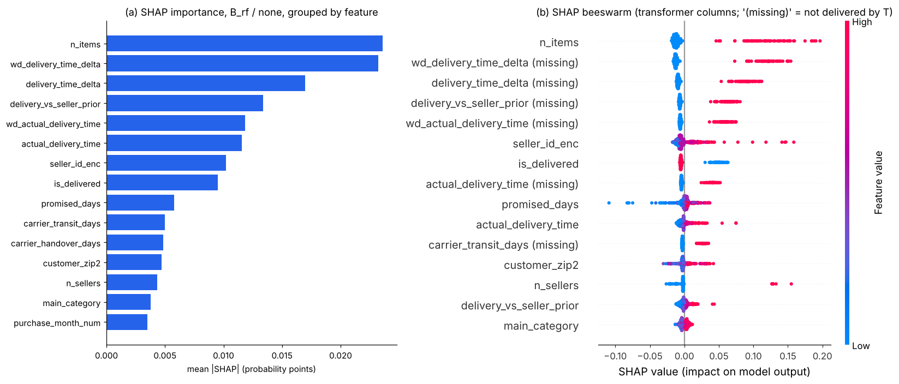

# Imbalance strategies × models, and SHAP on the final model

Updated: 2026-10-09 (stratified split, dry run `QUICK = True`)

The [executed Notebook](../notebooks/sampling_comparison.ipynb) repeats Experiment 4 of Zaghloul,
Barakat & Rezk (2024) — retrain every classifier under `RandomOverSampler`, `SMOTE` and `ADASYN` —
on our protocol, adds the two strategies the brief names (no adjustment, class weights), and reports
both the brief's imbalance-aware metrics and the paper's accuracy / weighted metrics. It then explains
the final model with SHAP.

## Design

- **Grid**: 4 tuned models (logistic C = 10; decision tree depth 12 / leaf 179; random forest depth 24 /
  leaf 95 / max features 0.70; CatBoost depth 6) × 5 strategies = 20 fits. Configurations are the
  ladder's (`outputs/selected_models.json`); nothing is re-tuned, so the table isolates the effect of
  the imbalance strategy on a fixed model.
- **Resampling is inside the pipeline** (`clf_sampling.build`): preprocessor → sampler → estimator, so
  synthetic rows are made from training rows only and validation / test rows are never resampled.
  Oversampling raises the training set from 52,482 to 90,092 rows (ADASYN 90,401–91,190).
- CatBoost receives the forest's numeric matrix in this study (SMOTE / ADASYN cannot interpolate string
  categories); its native-categorical ladder result is 0.500 test PR-AUC in `model_comparison.csv`,
  0.506 here with `none`, so the two encodings are equivalent for the comparison.
- Thresholds: F1-maximising on validation, frozen; test scored once per cell.

## Results (test set, 32,313 orders, 14.2% positive)

PR-AUC — the brief's primary metric for an imbalanced target (majority baseline 0.142):

| Model | none | class weight | RandomOverSampler | SMOTE | ADASYN |
|---|---:|---:|---:|---:|---:|
| Logistic | **0.490** | 0.486 | 0.486 | 0.483 | 0.471 |
| Decision tree | **0.483** | 0.482 | 0.461 | 0.451 | 0.459 |
| Random forest | **0.510** | 0.508 | 0.506 | 0.497 | 0.495 |
| CatBoost | **0.506** | 0.498 | 0.502 | 0.495 | 0.494 |

Brier score (probability quality, lower is better):

| Model | none | class weight | RandomOverSampler | SMOTE | ADASYN |
|---|---:|---:|---:|---:|---:|
| Logistic | **0.093** | 0.165 | 0.165 | 0.166 | 0.198 |
| Decision tree | **0.095** | 0.169 | 0.168 | 0.106 | 0.103 |
| Random forest | **0.092** | 0.147 | 0.147 | 0.098 | 0.099 |
| CatBoost | **0.092** | 0.163 | 0.162 | 0.095 | 0.095 |

The paper's metrics (random forest row): accuracy 0.870–0.874 and weighted F1 0.866–0.869 across all
five strategies — a spread of 0.4 points, inside noise, because 86% of rows are the majority class and
these metrics barely see the minority.

Source: [`outputs/tables/sampling_comparison.csv`](../outputs/tables/sampling_comparison.csv) (all
metrics, both views, fit seconds, rows after sampling); figure
[`05_sampling_comparison.png`](../outputs/figures/05_sampling_comparison.png).

**Findings**

1. **No strategy improves ranking.** For every model the best validation and test PR-AUC is `none`;
   class weights and RandomOverSampler cost 0–1 point, SMOTE and ADASYN 1–3 points (most for the single
   tree, which overfits the interpolated rows). ROC-AUC tells the same story (forest 0.791 → 0.780).
2. **Weighting and random oversampling are the same operation.** Their rows coincide to three decimals
   for the logistic model and the forest — duplicating minority rows to parity *is* a class weight of
   ≈ 6. Both shift the probability scale (Brier 0.09 → 0.15–0.17) without moving any order's rank.
3. **At the validation-tuned threshold the operating points are interchangeable**: precision 0.53–0.57,
   recall 0.47–0.52, F1 0.51–0.52 for every forest strategy. The threshold does the work a resampler is
   supposed to do, without the training cost (fit time +50%) or the calibration damage.
4. **Why this disagrees with the paper's headline.** Zaghloul et al. report their forest improving from
   0.86 to 0.90 AUC-ROC and weighted F1 0.88 → 0.92 after random oversampling, evaluated at a fixed 0.5
   cut without a validation set. Oversampling moves probabilities across 0.5, which improves recall at
   that cut and the weighted metrics with it; on a tuned threshold the same model gains nothing. Their
   comparison also includes post-outcome features (`review_comment_message`, actual delivery time) and
   a random split that lets 2018 training rows inform 2017 test rows, so the absolute levels are not
   comparable.
5. **Recommendation for the report.** Keep the ladder's models but report the forest **without class
   weighting** as the final scorer (same ranking, Brier 0.092 instead of 0.147, honest probabilities),
   state that class imbalance on this target affects calibration rather than ranking, and present the
   grid above as the evidence. This also matches the class-balance study in
   [ensemble_comparison.md](ensemble_comparison.md).

## SHAP on the final model

`shap.TreeExplainer` on the forest under `none`, 600 validation rows in the dry run (1,500 in the full
run), positive-class contributions in probability points; one-hot and missing-indicator columns are
summed per row onto their original feature before taking the mean absolute value
(`clf_explain.group_by_feature`). Tables: [`shap_importance.csv`](../outputs/tables/shap_importance.csv),
[`shap_cross_model.csv`](../outputs/tables/shap_cross_model.csv).

| Rank | Feature | mean \|SHAP\| | Direction (beeswarm) |
|---:|---|---:|---|
| 1 | `n_items` | 0.024 | more items → higher risk (multi-item / multi-seller orders, partial deliveries) |
| 2 | `wd_delivery_time_delta` | 0.023 | not yet delivered at T → +0.05 to +0.15; early delivery → small negative |
| 3 | `delivery_time_delta` | 0.017 | same signal in calendar days |
| 4 | `delivery_vs_seller_prior` | 0.013 | slower than this seller's usual → higher risk |
| 5 | `wd_actual_delivery_time` | 0.012 | long working-day duration → higher risk |
| 6 | `actual_delivery_time` | 0.012 | |
| 7 | `seller_id_enc` | 0.010 | a few sellers carry large positive contributions |
| 8 | `is_delivered` | 0.010 | |
| 9 | `promised_days` | 0.006 | short promises → lower risk; the widest negative tail |
| 10 | `carrier_transit_days` | 0.005 | |



Reading: the delivery-as-of-T block holds six of the top ten, consistent with the permutation
importance in `baseline_variant_review` (`is_delivered`, `n_items`, `wd_delivery_time_delta`,
`wd_actual_delivery_time` lead there too) and with the ablation (PR-AUC 0.515 → 0.285 without the block).
The two literature features of Zaghloul et al. rank 2nd and 5th — above their calendar-day versions —
so adopting them was worthwhile. `n_items` ranking first is the one result that is not simply
"lateness": orders with several items are more often split across shipments and sellers, and the
customer reviews the whole order. That is an actionable lever for the CX team (multi-item orders
deserve proactive status updates even when on time).

**Cross-model check.** Grouped SHAP ranks from CatBoost and the forest correlate at Spearman 0.87; the
logistic model agrees less (0.41) because its exact linear SHAP puts `promised_days` first — a linear
model cannot represent "late *relative to* the promise" without the interaction, which the trees learn.
Units differ (probability vs log-odds), so only ranks are compared. Dependence plots for the two
strongest numeric effects are in [`07_shap_dependence.png`](../outputs/figures/07_shap_dependence.png).

## Evidence limitations

- Dry-run budgets: 100-tree forest, 150-iteration CatBoost, 600-row SHAP sample. The ordering of the
  strategies is stable across the two dry runs made so far, but quote the `QUICK = False` numbers.
- Validation and test are stratified random samples of the 2016-18 order mix; see
  [current_progress.md](current_progress.md) for the chronological reference.
- SMOTE / ADASYN interpolate in the preprocessed space, where one-hot columns become fractional and
  target-encoded categories are averaged; this is standard practice but it is why the single tree
  degrades most. SMOTENC (categorical-aware) was not tried.

## Reproduce

```bash
cd "Phase 2/Classification"
python -m pip install imbalanced-learn shap
python scripts/run_notebook.py notebooks/sampling_comparison.ipynb   # after baseline_variant_review
python scripts/reproduce_classification.py --protocol-only
python scripts/verify_classification.py
```
