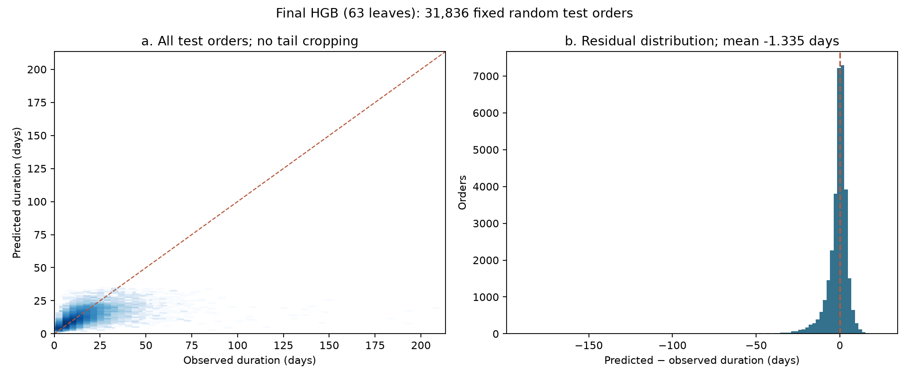
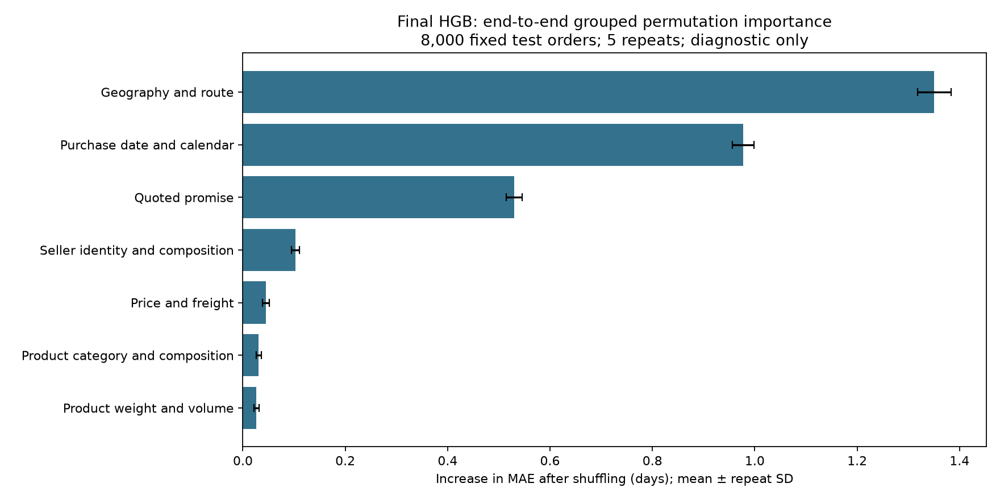

# Regression Report Evidence Guide · 报告填写版

更新：**2026-10-11**。本指南只负责 Regression，按共享 `Phase2_report_v2.docx` 的实际章节、Table 1/2、Figure 1/3 和附录组织。报告读取快照：**2026-10-11 00:01:31 SGT**（Drive 最后修改时间）；后续若章节改名，按主题对应。共享文档没有被修改。

**使用方式：** 中文是填写指示，英文段落可直接放入报告；表中数字可直接复制。结果统一保留四位小数、MAE/RMSE 单位为天。全文无需照搬本指南，正文选择主要对照，其余放附录。

**当前最终选择：63-leaf HistGradientBoostingRegressor（HGB），`leaves63__time_risk`。** Train MAE **3.9295**、五折 CV **4.2378 ± 0.0369**、Test **4.1505** 天。最新 stacking 仅有开发 CV，未形成最终全训练模型或测试结果；HGB 保持最终选择。

- [1.1/1.2：问题与 Phase 1 动机](#problem)
- [2.1：数据流程、缺失与异常](#data)
- [2.2/2.3：划分、防泄漏与特征](#split-features)
- [模型与调参段落](#models)
- [3.1 / Table 1：CV 与 Train](#cv-train)
- [3.2 / Table 2 / Figure 1：测试与误差](#test-errors)
- [3.4 / Figure 3：解释性](#interpretation)
- [4/5：业务、限制和结论](#discussion)
- [附录与复现](#reproduction)

<a id="problem"></a>

## A. 1.1 / 1.2：问题与 Phase 1 动机

**填入位置：** 1.1 的 Phase 1 findings 占位；1.2 最后一段中文待确认。1.2 现有 “identifiers excluded” 改成 **order and customer identifiers excluded; primary seller identity retained**。预测时点统一为 **order placement / purchase**，删除“批准时预测”表述。

| 项目 | 可直接填写的内容 |
|---|---|
| 目标 | `lead_time_days = (order_delivered_customer_date − order_purchase_timestamp).total_seconds() / 86400` |
| 单位 | 连续、含小数的天数；一单一行 |
| 分析总体 | 96,470 笔已完成配送、目标可观测且非负、有商品记录的订单 |
| 预测时点 | 购买时；不是批准、承运商交接或收货时 |
| 业务角色 | Customer-service and order-operations teams |
| 输出用途 | 配送时长点估计，辅助进度核查和预期沟通；不是有保证的到货日期 |
| 输入假设 | 归档中的报价、商品和卖家属性在购买时可获得；数据没有证明所有属性的历史可用时点 |

**1.1 可直接使用：**

> Phase 1 identified associations between delivery duration and purchase-time attributes, including seller–customer distance and the quoted delivery promise. These findings motivated lead-time prediction while not establishing causality or achievable predictive accuracy.

若要补数字，Phase 1 `03` **cell 23** 的 Spearman ρ 为：最大距离 **0.541**（n=95,994）、承诺时长 **0.522**（n=96,470）。这是 Phase 1 当时的地理处理口径，不要用其距离样本数替代下面 Phase 2 地理修正后的计数。[Phase 1 Notebook](../../../../notebooks/phase1/03_delivery_lead_time_regression_eda.ipynb)。

**1.2 可直接使用：**

> The task estimates purchase-to-receipt delivery duration in fractional days for orders with observed completed deliveries. Predictions use information assumed available at purchase; order and customer identifiers, reviews, final delivery status and post-purchase event timestamps are excluded from predictors. Primary seller identity is retained as a categorical feature. The output could assist customer-service and order-operations teams with arrival-expectation communication, subject to manual checks and operational validation.

<a id="data"></a>

## B. 2.1：数据流程、缺失与异常

**填入位置：** 2.1 Regression 数据处理段落与“异常值是否要补敏感性检查”问题。现有主体计数已正确；把“尚未进行敏感性分析”更新成下面的限定结论。

| 检查步骤 | 数量／处理 |
| --- | --- |
| 原始订单 | 99,441 |
| 标记 delivered | 96,478 |
| delivered 但缺少收货时间 | 8 笔排除 |
| 最终有效回归订单 | 96,470 |
| 剩余订单负配送时长／缺商品记录 | 0／0；没有因此额外排除 |
| 有效 >60 天订单 | 306；全部保留 |
| 超出地理筛查范围的坐标记录 | 29；排除坐标记录，不排除订单 |
| 缺最大距离 | 477；保留并填补 |
| 缺平均商品重量 | 22；保留并填补 |
| 收货早于批准或承运商交接的标记 | 84；训练 59、测试 25，保留并披露 |

七张原始表及行数：

| 表 | 原始行数 |
| --- | --- |
| orders | 99,441 |
| items | 112,650 |
| customers | 99,441 |
| sellers | 3,095 |
| products | 32,951 |
| geo | 1,000,163 |
| translation | 71 |

地理规则：纬度 **−35 至 6**、经度 **−75 至 −25**；筛查后对每个邮编前缀的**不重复经纬度坐标对**取中位数。该 V2 是本项目的处理版本，没有更换课程原始数据。支付与评价表不进入回归数据构建。

**时间异常敏感性，可直接使用：**

> The 84 chronology-flagged orders were retained because their purchase-to-receipt targets were non-negative and the archive did not identify which event timestamp was incorrect. An evaluation-only sensitivity check removed the 25 flagged test orders without refitting the model: MAE was 4.1523 days on 31,811 orders, compared with 4.1505 days on all 31,836 test orders. This small change does not validate the timestamps or assess retraining after excluding the 59 flagged training orders.

**注意：** 此检查只改变评分样本，不改变目标总体或拟合模型，不能写“已剔除全部异常订单重新训练”。

来源：[cohort flow](../results/report_supplement/tables/regression_cohort_flow.csv)、[原始表清单](../results/report_supplement/tables/source_table_inventory.csv)、[异常评价敏感性](../results/report_supplement/tables/chronology_evaluation_sensitivity.csv)。

<a id="split-features"></a>

## C. 2.2 / 2.3：划分、防泄漏与特征

**2.2 当前 Regression 段落基本可保留**；删除已经确认的 VERIFY 标记。将 “validation-selected” 改为 **CV-selected**。主实验不使用 March validation 或 July–August test。

| 参数／规则 | 确定值 |
|---|---|
| 原始有效总体 | 96,470 |
| 随机比例 | 67% / 33% |
| 训练 | 64,634 |
| 测试 | 31,836 |
| 随机 seed | 33 |
| CV | 训练集内 shuffled KFold，5 折，seed 33 |
| 单独验证集 | **无**；需要 Validation 列时填 `— (training-only CV)` |
| 主选择指标 | 五折 MAE 的等权平均 |
| 文献与项目设置 | 67/33 借鉴 Zaghloul et al.；seed 33 和五折是项目设置，不能说原论文报告了这两个值 |

预处理仅在拟合分区学习：中位数／类别填补、编码词表、类别频率处理、缩放均不从验证或测试学习。慢单风险的生成不能用整表标签回填：每外层回归折内部 **3 折**交叉拟合训练风险；外层验证风险由外层训练分类器生成。最终训练风险使用训练集 **5 折** OOF，测试风险来自全训练分类器。

**2.3 特征分组填写：**

| 分组 | 代表输入／变换 | 解释 |
|---|---|---|
| 地理／路线 | 最大距离、州／城市／邮编区路线、跨州、距离缺失指示 | 路线差异；距离是订单内最长卖家—客户路线 |
| 购买日期 | 月／星期／小时、周期变量、具体年月、距训练参考日期的天数 | 历史时期与日历变化；不证明未来时期可推广 |
| 承诺 | 预计送达−购买的天数、与距离／跨州的交互 | 报价信号；不代表准确实际送达天数 |
| 金额／运费 | 总价格、总运费、比例、平均单价 | 订单规模与运输暴露 |
| 卖家 | 主卖家 ID、卖家数／州数、主卖家金额占比 | 主卖家按订单商品金额聚合后确定 |
| 商品类别／组成 | 主类别、类别数、商品／不同商品数、主类别占比 | 订单组成 |
| 重量／体积 | 平均／最大／总重量和体积、缺失指示 | 潜在处理需求 |
| 学习风险 | `risk_p30 = P(delivery > 30 days | purchase inputs)` | 对已有购买信息的学习变换；不是新增原始信息或真实慢单标签 |

最终矩阵：**1,019 个基础编码列 + 22 个时间编码列 + 1 个风险列 = 1,042 列**。这是完整训练拟合后的编码维度，不是 1,042 个原始变量；各折词表和编码维度可不同。

**补在风险特征段落后的短句：**

> The learned risk score adds no new raw information. With the selected 63-leaf HGB settings, time-only and time-plus-risk CV MAEs were 4.2399 and 4.2378 days, respectively; the incremental improvement was only 0.0021 days.

来源：[split population](../results/report_supplement/tables/split_population.csv)、[完整特征目录](../results/report_supplement/tables/final_feature_catalogue.csv)、[编码维度](../results/report_supplement/feature_design.json)、[随机协议](../config/random_split_protocol.json)。

<a id="models"></a>

## D. 模型与调参段落

**填入位置：** 草稿 2.3 后的第二个 Regression 模型段落；当前缺少独立标题，可由整合时放入 2.4 Model development / 2.5 Hyperparameter tuning。以下不是新增实验。

**正式模型主线：** OLS / 单树简单基线 → Ridge / RF 及输入变体 → HGB 输入补强 → 时间／风险消融 → HGB 参数比较 → stacking 比较 → 保留 HGB。承诺、均值、中位数是业务／非学习参照，不能替代拟合基线。

| 最终 HGB 参数 | 值 |
|---|---|
| loss | `absolute_error` |
| max_iter | 300 |
| learning_rate | 0.05 |
| max_leaf_nodes | **63** |
| min_samples_leaf | 30 |
| l2_regularization | 10 |
| early_stopping | `False` |
| random_state | 33 |
| 输入包 | `time_risk`，全部购买信息扩展 |

**调参段落，可直接使用：**

> A bounded HGB search compared eight parameter settings on the fixed time-plus-risk feature package, varying leaf count, minimum leaf size, regularisation, iteration count or learning rate relative to the 31-leaf control. The selected 63-leaf setting was then checked with time-only inputs. Selection used mean five-fold training CV MAE, with preprocessing and risk construction kept inside the fitting partitions. The selected parameters were frozen before this stage's test scoring; the test set and development folds had nevertheless informed earlier exploratory work.

阶段 A：8 设置×5 折=40 记录（35 新拟合+5 已有控制）；阶段 B：63 叶 time-only 5 新拟合+已有 time-only 控制5记录。**总计50条逐折记录、40次新回归拟合**。不描述成完整参数网格、全局最优或全流程无偏嵌套选择。

来源：[候选参数／CV 表](../results/tables/parameter_comparison.csv)、[逐折结果](../results/tables/cv_folds.csv)、[冻结选择](../config/selected_model.json)、[所有正式比较模型配置](../config/report_models.json)。

<a id="cv-train"></a>

## E. 3.1 / Table 1：CV 与 Train

**当前 Table 1 的 Fixed/Tuned Ridge、RF 来自 stacking 的另一组配置，不能用下表的 Train/Test 填到这些旧行。** 推荐将 Table 1 主体换成 **E1：已完成全训练拟合的模型**；将现有 stacking 调参行放入 **E2：开发程序比较**（正文短表或附录）。两表共用同一训练订单和外折，但模型配置／输入不同。

### E1. 可直接复制：固定配置的 Train 与五折 CV

**表中输入版本的含义：**

- **F0**：16个基础字段，涵盖承诺、距离、价格／运费、商品／卖家数、平均重量、缺失指示、客户州／跨州／主类别，以及购买月／星期／小时。
- **F1**：F0加6个日历周期变量、3个距离／承诺／跨州交互和1个州路线字段；不是更换数据集。
- **expanded purchase inputs**：进一步加入卖家身份、细化路线、商品组成／重量／体积等购买信息。
- **time/risk**：再加入具体年月／绝对日期，以及折内生成的 >30天风险概率；`log inputs`与`log1p target`分别表示输入变换和目标变换，二者不同。

| 模型（请保留输入版本名称） | 角色 | CV MAE mean ± SD (days) | Train MAE (days) |
| --- | --- | --- | --- |
| Delivery promise (reference) | non-ML reference | 12.7308 ± 0.0567 | 12.7308 |
| Training mean (reference) | non-ML reference | 6.4439 ± 0.0340 | 6.4437 |
| Training median (reference) | non-ML reference | 6.1480 ± 0.0417 | 6.1478 |
| OLS baseline — F0 | baseline | 5.0196 ± 0.0423 | 5.0045 |
| Single decision tree — F0 | baseline | 5.0585 ± 0.0532 | 4.9751 |
| Ridge — F1, log inputs, alpha 100 | linear variant | 4.9836 ± 0.0412 | 4.9724 |
| RF — F1, original target | tree variant | 4.7269 ± 0.0532 | 3.8850 |
| RF — F1, log1p target | tree variant | 4.5386 ± 0.0493 | 3.7645 |
| OLS — F0 + time/risk | input variant | 4.7741 ± 0.0465 | 4.7550 |
| Single tree — F0 + time/risk | input variant | 4.7615 ± 0.0417 | 4.6530 |
| Ridge — F1 + time/risk | input variant | 4.7375 ± 0.0444 | 4.7223 |
| RF — F1 + time/risk, log1p target | input variant | 4.4152 ± 0.0389 | 3.6214 |
| HGB — expanded purchase inputs | feature variant | 4.4052 ± 0.0494 | 4.2298 |
| HGB control — 31 leaves, time/risk | pre-tuning control | 4.2729 ± 0.0408 | 4.1118 |
| Selected HGB — 63 leaves, time/risk | CV-selected final model | 4.2378 ± 0.0369 | 3.9295 |

篇幅有限时，正文至少保留 OLS、单树、Ridge F1、RF F1、31叶 HGB 和63叶 HGB，业务参照可在 Table 2；其他输入变体放附录。对应 R²、RMSE、每折和 pooled OOF 在完整 CSV 中。

**Train/CV 口径：** Train 是全训练回归模型在拟合输入上的评分；风险模型使用拟合时的 cross-fitted 风险列，不用全训练分类器的样本内概率。CV 是五个 held-out 折指标的**等权均值**，不是全训练拟合分数。SD 使用样本标准差 **ddof=1**；也提供 ddof=0 数据便于全组统一。SD 不是置信区间。不要用 `parameter_comparison.csv` 的 `fit_MAE`（外折拟合分数均值）代替这里的全训练 Train。

**3.1 可直接使用：**

> Mean five-fold MAE selected the 63-leaf HGB, with CV MAE of 4.2378 ± 0.0369 days and full-training MAE of 3.9295 days. The 31-leaf time-plus-risk control had CV MAE of 4.2729 days. The final comparison includes model-specific feature representations, so gains over OLS or a single tree cannot be attributed to algorithm choice alone. No separate regression validation set was used.

### E2. 草稿现有 Fixed/Tuned 行的正确对应（开发 CV）

| 模型／程序 | Outer-CV MAE mean ± SD (days) | 最终 Train | 说明 |
| --- | --- | --- | --- |
| Fixed Ridge | 5.0352 ± 0.0371 | — | 仅评价外层程序；无最终全训练拟合 |
| Fixed random forest | 4.8062 ± 0.0517 | — | 仅评价外层程序；无最终全训练拟合 |
| Tuned Ridge | 4.9219 ± 0.0364 | — | 仅评价外层程序；无最终全训练拟合 |
| Tuned random forest | 4.6002 ± 0.0436 | — | 仅评价外层程序；无最终全训练拟合 |
| Published HGB | 4.2378 ± 0.0369 | 3.9295 | 已完成最终单模型拟合；同 E1 |
| Tuned Ridge + forest: mean | 4.6632 ± 0.0384 | — | 仅评价外层程序；无最终全训练拟合 |
| Tuned Ridge + forest: MAE stack | 4.5964 ± 0.0417 | — | 仅评价外层程序；无最终全训练拟合 |
| Tuned Ridge + forest + HGB: mean | 4.4441 ± 0.0378 | — | 仅评价外层程序；无最终全训练拟合 |
| Tuned Ridge + forest + HGB: MAE stack | 4.2374 ± 0.0371 | — | 仅评价外层程序；无最终全训练拟合 |

`—` 在此表示**没有最终全训练拟合，无法提供对应成绩**，不是零，也不能从其他模型借值。Fixed classic 只作为本次 outer-CV 控制，没有在该 stacking 程序中完成最终全训练拟合；调参程序各折可选择不同设置，不能假装存在一个统一的已拟合“最终 Tuned Ridge/RF”。

版本核对：

- 草稿 **Fixed Ridge 5.0352** = **F0、log inputs、alpha 1000**；不是 E1 的 **Ridge F1 alpha100（4.9836）**。
- 草稿 **Fixed RF 4.8062** = **F0、100树、depth24、leaf10、max_features0.8、max_samples0.8**；不是 E1 的 **RF F1（4.7269）**。
- 草稿 **Tuned Ridge 4.9219 / Tuned RF 4.6002** = 每外折训练内3折选参数的程序成绩；没有对应最终 Train/Test。RF 不是“final configuration to confirm”，应改为 **Nested-tuned RF (outer-CV only)**。
- 最新 stacking：5外折／3内折，12 Ridge候选、6 RF候选；非负权重和为1、截距0、按内层OOF最小化MAE。HGB内层OOF重新构建，风险继续内部cross-fit；现成HGB外折预测只用于对应外折评价。
- HGB 外折也曾用于之前开发，因此这不是对整个历史选择过程的新独立嵌套验证。

**Stacking 结果段落，可直接使用：**

> The nested-tuned three-model stack achieved outer-CV MAE of 4.2374 ± 0.0371 days versus 4.2378 ± 0.0369 for HGB. The gain was 0.000419 days, approximately 36 seconds (0.0099%). HGB received approximately 97.6%–99.4% of the learned weight and Ridge received zero in every fold. This limited gain did not justify retaining the more complex combination. The procedure was not refitted on all training orders or evaluated on the test set; HGB remains the selected final model.

来源：[E1 完整成绩](../results/report_supplement/tables/train_cv_test_comparison.csv)、[75条逐折指标](../results/report_supplement/tables/cv_fold_metrics.csv)、[E2 程序比较](../results/report_supplement/tables/stacking_outer_cv_comparison.csv)、[最新 stacking Notebook](../notebooks/tuned_stacking_comparison.ipynb)。

<a id="test-errors"></a>

## F. 3.2 / Table 2 / Figure 1：测试与误差

**Test sample size 填 31,836。** Table 2 的 business baseline 可用 **Training median** 并保留 **Delivery promise**；family baselines 为 OLS、单树；selected model 为63叶HGB。以下所有行都是同一批测试订单，不是旧月份窗口。

### Table 2 可直接复制的数据

| 模型 | MAE (days) | RMSE (days) | R² |
| --- | --- | --- | --- |
| Delivery promise (reference) | 12.7219 | 15.0933 | -1.5854 |
| Training mean (reference) | 6.3743 | 9.3872 | -0.0001 |
| Training median (reference) | 6.0752 | 9.6616 | -0.0594 |
| OLS baseline — F0 | 4.9607 | 7.8947 | 0.2926 |
| Single decision tree — F0 | 5.0297 | 8.0311 | 0.2680 |
| Ridge — F1, log inputs, alpha 100 | 4.9214 | 7.8537 | 0.3000 |
| RF — F1, original target | 4.6525 | 7.5879 | 0.3466 |
| RF — F1, log1p target | 4.4542 | 7.7209 | 0.3234 |
| OLS — F0 + time/risk | 4.6983 | 7.5970 | 0.3450 |
| Single tree — F0 + time/risk | 4.6783 | 7.6125 | 0.3423 |
| Ridge — F1 + time/risk | 4.6615 | 7.5591 | 0.3515 |
| RF — F1 + time/risk, log1p target | 4.3163 | 7.5355 | 0.3556 |
| HGB — expanded purchase inputs | 4.3303 | 7.7135 | 0.3247 |
| HGB control — 31 leaves, time/risk | 4.1923 | 7.5028 | 0.3611 |
| Selected HGB — 63 leaves, time/risk | 4.1505 | 7.4651 | 0.3675 |

**E2 的 nested-tuned Ridge、RF 和最新 stack 没有 Test；如 Table 2 加入这些行，三列都填 `— (not evaluated)`。** 不能把 E1 的 Ridge/RF Test 对应到 E2 的 Tuned CV。

### 主指标改善与额外指标

| 比较／指标 | 值 |
| --- | --- |
| 相对 OLS baseline 的测试 MAE 降幅 | 16.33% |
| 相对单树 baseline 的测试 MAE 降幅 | 17.48% |
| 相对训练中位数参照的测试 MAE 降幅 | 31.68% |
| 相对31叶time/risk HGB的降幅 | 1.00%（0.0418天，约60分钟） |
| 平均 signed error（预测−实际） | -1.3349 天 |
| P90 absolute error | 9.0914 天 |
| 误差≤3天 | 56.93% |
| 预测低于实际的订单占比 | 49.83% |

相对降幅公式：`100 × (reference MAE − final HGB MAE) / reference MAE`。MAE4.1505是平均误差，不是每笔订单误差保证；R²不应写成“准确率36.75%”。

### 错误子群体（Table 2 后分析或附录）

| 分组 | n | MAE (days) | Bias: predicted−actual (days) |
| --- | --- | --- | --- |
| 0–7 days | 8,584 | 2.2940 | 1.9441 |
| 7–14 days | 13,334 | 2.6044 | 0.6293 |
| 14–30 days | 8,454 | 5.3738 | -4.1787 |
| 30–60 days | 1,365 | 18.8525 | -18.8266 |
| >60 days | 99 | 66.1881 | -66.1881 |
| All sellers same-state | 11,431 | 2.9544 | -1.0426 |
| Any seller cross-state | 20,405 | 4.8205 | -1.4987 |

时长组完整覆盖31,836测试订单；路线组另完整覆盖同一总体，两个分组维度不能相加。真实时长只用于结果切片，不是模型输入。

**3.2 可直接使用：**

> On 31,836 test orders, the selected HGB achieved MAE of 4.1505 days, RMSE of 7.4651 days and R² of 0.3675. MAE was 16.33% lower than OLS and 17.48% lower than the single-tree baseline, with model and feature changes both contributing to the comparison. Predictions were within three days on 56.93% of orders. Mean signed error was −1.3349 days, indicating overall underprediction. Errors were higher for cross-state orders (n=20,405; MAE 4.8205) than same-state orders (n=11,431; MAE 2.9544). Valid 30–60-day deliveries (n=1,365) and >60-day deliveries (n=99) remained poorly predicted, with MAEs of 18.8525 and 66.1881 days.

### Figure 1：插入这张现成图



**可直接使用的图注：**

> **Figure 1.** Predicted versus observed delivery duration and residual distribution for the selected 63-leaf HGB on all 31,836 random-test orders. Duration is measured in fractional days; residual equals predicted minus observed duration. All valid extreme durations are retained. The diagonal represents perfect prediction and zero residual represents no error. The test set had informed earlier exploratory development.

来源：[完整测试数据](../results/report_supplement/tables/metrics_by_phase.csv)、[降幅](../results/report_supplement/tables/hgb_improvement_vs_references.csv)、[分组结果](../results/report_supplement/tables/hgb_test_error_groups.csv)、[误差摘要](../results/report_supplement/error_diagnostics.json)。

<a id="interpretation"></a>

## G. 3.4 / Figure 3：解释性

**填入位置：** Regression leading predictors 占位和 Figure 3 回归面板。已有方法是 **end-to-end grouped permutation importance**，不是 SHAP、系数或内置 impurity importance。

模型固定为最终63叶HGB；随机 seed33 选 **8,000测试订单**；**每组5次置换**；重要性是 **MAE增加的天数**。未置换子样本MAE为 **4.1280天**，不是全测试的4.1505。每次同步打乱该组原始字段，重新计算派生日期／交互及辅助风险，固定预处理不重新拟合；不根据解释结果重新选模型。

| 特征组 | MAE increase mean (days) | SD across 5 repeats (days) |
| --- | --- | --- |
| Geography and route | 1.3504 | 0.0328 |
| Purchase date and calendar | 0.9771 | 0.0212 |
| Quoted promise | 0.5302 | 0.0155 |
| Seller identity and composition | 0.1026 | 0.0082 |
| Price and freight | 0.0451 | 0.0069 |
| Product category and composition | 0.0310 | 0.0048 |
| Product weight and volume | 0.0266 | 0.0051 |

**3.4 可直接使用：**

> Grouped permutation analysis of the frozen final model indicated the strongest reliance on geography/routes, purchase date/calendar and the quoted delivery promise. Shuffling these groups increased MAE by 1.3504, 0.9771 and 0.5302 days, respectively, on a fixed 8,000-order test sample. Derived features and the auxiliary risk score were recomputed after each shuffle. Correlated groups and atypical shuffled combinations limit interpretation: these increases are neither causal effects nor additive shares of prediction error. Date reliance also does not establish future-period robustness.

与 Classification 对比时，只比较信号主题和预测时点：回归使用购买时信号；分类可使用T时已知配送进展。**不能直接比较 MAE增加（天）与 AP下降／SHAP值的数值大小。** 若报告不展示 Ridge系数／RF重要性，删除“Ridge versus forest解释”占位即可；它不是本次已完成的最终模型解释。

### Figure 3：回归面板



**可直接使用的图注：**

> **Figure 3, regression panel.** End-to-end grouped permutation importance for the selected HGB on 8,000 fixed random-test orders (seed 33). Bars show mean MAE increase in days over five shuffles; error bars show sample SD across repeats. Derived calendar/interactions and auxiliary risk are recomputed without refitting. Increments are not additive or causal effects, and the SD bars are not confidence intervals.

来源：[重要性表](../results/report_supplement/tables/hgb_grouped_permutation_importance.csv)、[35条重复结果](../results/report_supplement/tables/hgb_grouped_permutation_repeats.csv)、[解释输入检查](../results/report_supplement/interpretation_verification.json)。

<a id="discussion"></a>

## H. 4/5：业务、限制和结论

### 4.1 业务建议

草稿现有 Regression 4.1 基本合理：保留“辅助人工核查”“干预效果待验证”。**不要把配送时长的MAE表现直接当作 late-order screening precision/recall**，也不要把辅助 >30天风险等同于“超过原承诺”的风险。

> The selected model could inform arrival-expectation discussions and prioritise fulfilment checks, with manual verification for unusually slow or cross-state orders. A point estimate should not be communicated as a guaranteed arrival date. Late-order screening accuracy, service-capacity trade-offs and any effect on satisfaction or cost require separate operational evaluation.

### 4.2 回归限制：可直接使用

> Regression evaluation is conditional on observed completed deliveries and excludes unresolved outcomes. Archived seller, product and quoted-promise information is assumed available at purchase, without a full historical availability record. Random splitting measures performance within the same historical mixture, including recurring sellers and routes, rather than future periods or unseen sellers. Development folds and the test set informed earlier exploration, so results are retrospective comparisons rather than untouched external confirmation. The search was bounded and model/feature representations differed across configurations. Extreme deliveries remain severely underpredicted, while the small gains from risk features and stacking do not establish material operational benefit. Permutation importance is predictive rather than causal, and no controlled intervention was evaluated.

可以压缩文字，但至少保留：**完成总体选择、购买信息可用性假设、随机协议、重复开发曝光、长尾误差、未验证业务效果**。

### 5 Conclusion：回归占位可直接替换

> The selected 63-leaf HGB achieved test MAE of 4.1505 days, 16.33% below the OLS baseline, with RMSE of 7.4651 days and R² of 0.3675. Stacking added only about 36 seconds of mean outer-CV improvement and was not retained. The model could assist delivery-expectation communication, but substantial underprediction of rare slow deliveries and retrospective random evaluation limit stronger operational claims.

后接 Classification 的实际结论；不要使用回归数据补它的占位。

<a id="reproduction"></a>

## I. 附录与复现

**Regression appendix checklist 的替换清单：**

| 附录主题 | 已完成证据 |
|---|---|
| 原表／目标流程／缺失 | [source inventory](../results/report_supplement/tables/source_table_inventory.csv)、[cohort flow](../results/report_supplement/tables/regression_cohort_flow.csv) |
| 特征定义／可用性 | [feature catalogue](../results/report_supplement/tables/final_feature_catalogue.csv)、[encoded design](../results/report_supplement/feature_design.json) |
| 主划分／CV | [random split configuration](../config/random_split_protocol.json)、[75条主表逐折成绩](../results/report_supplement/tables/cv_fold_metrics.csv) |
| 模型配置／搜索／最终参数 | [model specifications](../config/report_models.json)、[parameter comparison](../results/tables/parameter_comparison.csv)、[selected model](../config/selected_model.json) |
| 完整 Train/CV/Test | [comparison CSV](../results/report_supplement/tables/train_cv_test_comparison.csv) |
| 错误／异常评价 | [error groups](../results/report_supplement/tables/hgb_test_error_groups.csv)、[timestamp sensitivity](../results/report_supplement/tables/chronology_evaluation_sensitivity.csv) |
| HGB解释 | [grouped importance](../results/report_supplement/tables/hgb_grouped_permutation_importance.csv) |
| 最新 stacking | [guide](../../random_stacking/nested_tuning/README.md)、[outer fold table](../../random_stacking/nested_tuning/results/tables/outer_fold_metrics.csv)、[weights](../results/report_supplement/tables/stacking_fold_weights.csv) |
| 复现核对 | [fixed Train/Test reproduction](../results/report_supplement/reproduction_verification.json)、[OOF/model checks](../results/report_supplement/verification.json)、[artifact validation](../results/report_supplement/artifact_validation.json) |

**Chronological backtests** 是 [historical_temporal](../../historical_temporal/README.md) 的旧协议。如保留，标题写 **Historical exploratory time-split experiments**，放独立附录；主表不混用其分数。阶段旧记录中的“test not scored”不代表当前HGB状态。

### 报告中的准确入口

当前整体阅读入口：[delivery_regression_complete.ipynb](../notebooks/delivery_regression_complete.ipynb)，从数据质量／准备到最终选择完整串联；[课程规范与Notebook结构核对](notebook_alignment.md)。默认不重训，已明确列出重建数据与固定模型训练模式。

从仓库根目录：

- `Phase 2/Regression/delivery_regression_best/notebooks/best_scheme_review.ipynb`
- `Phase 2/Regression/delivery_regression_best/notebooks/report_supplement_review.ipynb`
- `Phase 2/Regression/delivery_regression_best/notebooks/tuned_stacking_comparison.ipynb`
- 当前最终模型：`Phase 2/Regression/delivery_regression_best/scripts/reproduce_best.py`
- 主表固定模型重建：`Phase 2/Regression/delivery_regression_best/scripts/reproduce_report_supplement.py`
- 最新 stacking 重建：`Phase 2/Regression/random_stacking/nested_tuning/README.md` 所列独立命令。

进入 `Phase 2/Regression/delivery_regression_best/`，Python **3.12**：

```bash
python -m pip install -r requirements.txt
python scripts/verify_bundle.py
python scripts/verify_report_supplement.py
python scripts/reproduce_best.py --archive /absolute/path/IT5006_Project-Data.zip --output runs/best_reproduction
```

仅重建数据不拟合：在 `reproduce_best.py` 命令加 `--prepare-only`。重建最终模型CV：加 `--with-cv`。重建E1全部固定模型：

```bash
python scripts/reproduce_report_supplement.py --archive /absolute/path/IT5006_Project-Data.zip --output runs/report_reproduction --with-cv
```

`reproduce_report_supplement.py` 不加 `--with-cv` 时只重建Train/Test及解释，不重算回归CV。输出目录必须是不存在的新 `runs/` 子目录。三个当前Notebook显示公开结果，不自动重训全部实验。数据、OOF、逐单预测和模型不上传。

**复现范围如实填写：** 原实验已完成并核对OOF和模型；报告补充从完整保存OOF重新计算75条CV指标。另从课程ZIP独立重建并重拟合12固定回归+3参照，15行Train/Test精确复现；未再次完整重跑75条回归CV或所有历史参数搜索。目录整理后3份当前回归Notebook在新位置执行通过，保存原输出。该范围不能写成“所有历史实验已从零重复两次”。

依赖以 [requirements.txt](../requirements.txt) 为准，例如 scikit-learn **1.7.2**、pandas **2.2.3**、numpy **2.3.5**、joblib **1.6.0**。模型与汇总来源可追溯整理提交 **`e2eb175`**，不是报告定稿日期；提交报告时填写最终实际使用的Git提交。

### 提交前仅需核对这些文字

- [ ] 删除 Regression 的中文／INSERT／VERIFY 待填标记，统一购买时预测。
- [ ] Table 1区分E1固定模型与E2 nested调参程序；没有独立Validation。
- [ ] Table 2统一31,836订单；缺少对应最终拟合的程序明确填 `—`。
- [ ] Figure 1/3插入实际图片并保留方法、样本、单位与图注。
- [ ] 报告提升比例与参考行匹配，不把R²当准确率、不把全部收益归因于算法或调参。
- [ ] 主实验随机协议与历史时间实验分开；Classification由其对应工程填写，当前 Classification 路径为 `Phase 2/Classification/`。
- [ ] Regression、Classification不同预测时点和总体在报告中明确，指标的CV均值／SD定义统一。
- [ ] References保留实际使用的引用，67/33借鉴不描述成完整复现论文；此指南不新增未经核对的文献条目。
- [ ] AI声明与全组实际使用情况一致；本指南不代替全组声明。

本指南重排现有证据，未改变模型、目标、分区或结果，也未修改共享Google文档。AI辅助整理与实现；数值依据已运行产出与独立核对。
