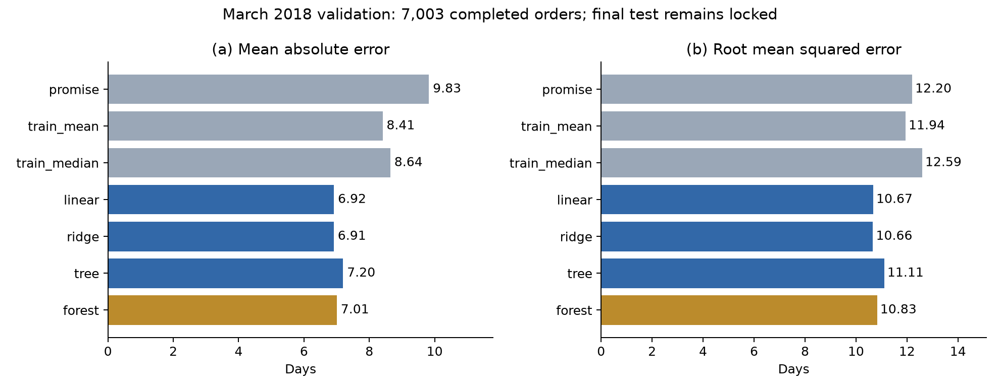
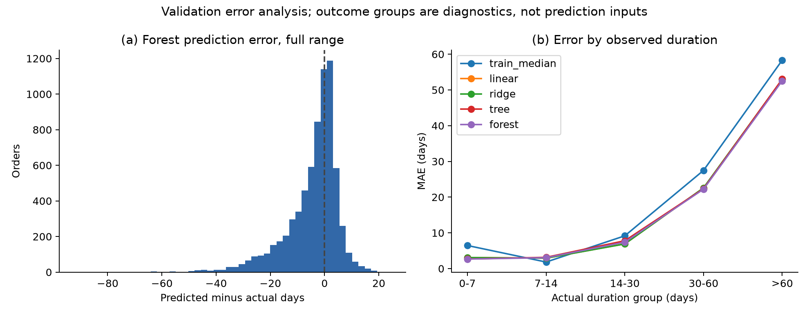
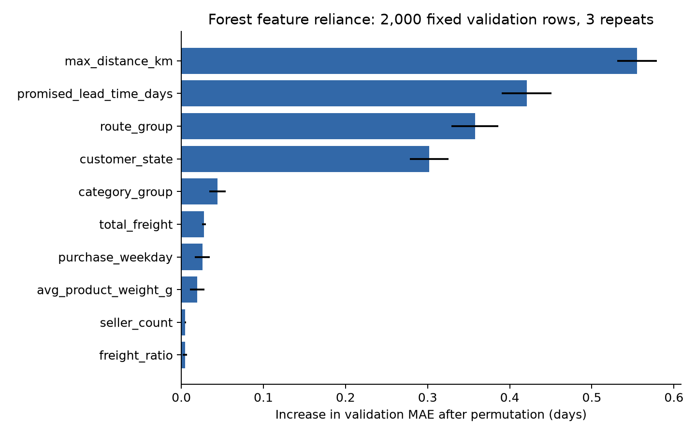

# Delivery Lead-time Regression — development report material

**最新特征/回测更新（2026-10-05）：** [特征优化说明](feature_optimization.md)和[已运行Notebook](../notebooks/feature_optimization.ipynb)记录新增18组配置，未找到进一步收益；保留上一轮Ridge/森林，三月MAE6.847/6.913天。恢复3,669笔慢订单后成熟历史CV5.236/5.219天；旧约4.54天须标为条件化口径。以下原交接/报告/导读保留历史语境，不能与新版本混用，最终测试未评分。

**修正已落实：** 正式`prepare_data`默认已改为筛查异常坐标、去重复参考点、邮编中位数；独立生成并核对的v2输入位于`versions/preparation_v2/data/eligible_orders.csv`。原始ZIP、旧`data/eligible_orders.csv`和模型/OOF/预测保留。下一轮模型使用v2并统一更新全部结果；当前6–7天MAE仍属于v1，没有重训或重新评分。下文候选探索记录保留检查过程，以此修正状态为准。

**2026-10-05 数据复核更新：以下模型结果与交接文件使用旧邮编均值输入。有效订单/目标保持，地理处理已修正并生成v2；`notebooks/data_preparation_audit.ipynb`已运行核对。下一轮使用v2重训及重生成OOF之后才能定稿交接。当前审计没有模型拟合或测试评分。**

**Status:** baseline and variant experiments completed on development data; stacking and final-test evaluation pending. This section is a source-backed draft for the integrated 6–8-page team report, not a completed Phase 2 submission. Tables and figure labels below are local module labels; renumber them during integration.

## Problem, inputs and evaluation

At order placement, the task predicts fractional days from purchase to customer receipt, with one row per order. A customer-service/order-operations manager could use this estimate to communicate arrival expectations. It is a point estimate, not a calibrated delivery promise. The course archive provides 96,470 completed orders with valid non-negative durations and item records; all 306 valid durations above 60 days are retained. Seven source tables provide 16 predictors: quoted duration, maximum observed seller–customer centroid distance, customer state, all-seller route group, order price and freight totals, freight ratio, item/seller counts, average product weight, two missingness indicators, product-category group and purchase month/weekday/hour. Exact source columns and formulas appear in `config/feature_roles.csv`; actual receipt, final status, reviews, later payment/approval and arbitrary identifiers are excluded from X.

Geographic and temporal proxies reflect the delivery-estimation problem discussed by Zhang et al. (2023); archived promised duration supplies an operational reference related to the forecasting/promise distinction in Salari et al. (2022). These are task-motivated adaptations, not replications of their graph or quantile models. Availability of the original quote and static geographic reference is assumed because the archive lacks revision histories.

Chronological development training contains 53,644 orders purchased and received before 1 March 2018. March purchases supply 7,003 validation orders, including 37 durations above 60 days; their labels are all observed before 1 July. April–June is a label-maturation gap. A later 12,507-order July–August test cohort remains unscored. The 3,673 earlier purchases still undelivered at the training cutoff are counted separately, not treated as invalid. Three expanding training folds forecast July–September 2017, October–December 2017 and January–February 2018, using only receipts observed before each forecast cutoff. CV scores are conditional on development labels known by 1 March, which particularly underrepresents slow recent orders. They must not be interpreted as uncensored future-delivery performance.

Each fold fits median imputation, numeric scaling and categorical encoding within its training pipeline. Calendar categories have fixed known domains; rare geographic/product categories are pooled using training frequency only. Predictions have a common non-negative boundary. MAE is primary because its unit is directly interpretable in days; RMSE emphasizes large errors, while R², signed bias and tail errors reveal complementary weaknesses.

## Baselines, variants and findings

Quoted duration and training-only mean/median predictions are fixed references. The linear family progresses from ordinary least squares to Ridge; the tree family progresses from a single decision tree to a random forest. The limited search compares tree depths 8/14 (minimum leaf 20), two 100-tree forest settings, a controlled log1p-target forest trial and Ridge alpha 10/100. Ridge was added after unstable early-fold linear behaviour was observed during development; this was not a fully preregistered experiment. Configuration choice uses mean training-CV MAE, with March validation reserved for development comparison. Seed 5006 and all settings are recorded.

**Table R1. March validation performance on the same 7,003 orders.** Bias is predicted minus actual duration. Tail MAE uses 37 actual durations above 60 days.

| Model | MAE (days) | RMSE (days) | R² | Bias (days) | Tail MAE (days) |
|---|---:|---:|---:|---:|---:|
| Quoted duration | 9.83 | 12.20 | −0.135 | +5.73 | 40.75 |
| Training mean | 8.41 | 11.94 | −0.087 | −3.38 | 56.48 |
| Training median | 8.64 | 12.59 | −0.209 | −5.24 | 58.33 |
| Linear regression | 6.92 | 10.67 | 0.131 | −4.33 | 52.95 |
| Ridge (alpha 100) | **6.91** | **10.66** | **0.133** | −4.31 | 52.92 |
| Decision tree (depth 8) | 7.20 | 11.11 | 0.059 | −4.28 | 53.03 |
| Random forest (depth 24, leaf 10) | 7.01 | 10.83 | 0.106 | −4.37 | 52.55 |

Ridge improves early-fold stability: mean CV MAE falls from 9.58 (fold SD 7.09) for plain linear regression to 4.62 (SD 0.96). In the first training fold, September has only one order; its calendar coefficient shrinks from 45.92 days to 0.45 with Ridge (month-support and coefficient audit tables). This supports, rather than proves exclusively, the interpretation that sparse seasonal effects contributed to instability. The selected forest has CV MAE 4.55 (SD 0.85), versus 4.70 (SD 0.78) for the selected single tree. The log-target forest scores 4.61, so it is not selected (`cv_summary.csv`). In March, forest improves on the single tree but does not beat either linear model (Table R1; Figure R1a–b). The 0.004-day Ridge advantage over plain linear regression is too small to establish practical superiority; its stronger argument is stability across historical folds. No confidence interval or significance claim is made.

Averaging randomized trees is intended to stabilize a single tree; the observed forest gain is modest and does not establish that extra nonlinear complexity is preferable to the linear family. All learned models underestimate March duration by about 4.3 days. Mean observed duration increases from 12.92 in development training to 16.30 in March (`period_target_summary.csv`), consistent with a harder later period; the archive does not establish the operational cause. Tail MAE remains approximately 53 days, and the conservative quote is closer on this small tail slice despite worse overall MAE (Table R1; Figure R2; `duration_errors.csv`). Overall improvement therefore does not establish reliable estimates for extreme delays.

Forest permutation analysis on 2,000 fixed March orders identifies distance, promise, route group and customer state as the strongest feature dependencies: shuffling them increases MAE by approximately 0.56, 0.42, 0.36 and 0.30 days, respectively (Figure R3). Three-repeat error bars represent permutation variability, not confidence intervals. Correlated geographic inputs can share importance; these results are predictive dependencies, not causal effects.

## Selection, business meaning and remaining work

Ridge and forest are useful candidates for the next comparison: Ridge combines competitive March error with improved linear stability, while forest improves the tree baseline and has strong historical CV results. Neither is a final selected deployment model. Thirty-nine thousand four hundred forty-five common chronological OOF rows and four fitted development pipelines are ready for separate stacking integration; 14,199 warmup rows lack an earlier-trained forecast and are excluded. Configuration selection uses development CV, so these OOF predictions are meta-training inputs rather than an unbiased final performance estimate.

After the stacking design is frozen, refit using historical labels available before July, extending temporal OOF if the meta-training period is expanded, and evaluate all frozen models on the same locked test cohort. Completion-only selection, finite label maturity, centroid geography, possible quote revisions and missing operational disruptions limit generalization. Test-tail evidence will also be sparse (six eligible durations above 60 days). The current model could support exploratory arrival communication, but its bias and tail failures argue against automatically replacing customer promises or asserting cost/satisfaction gains.

## References

Salari, N., Liu, S., & Shen, Z.-J. M. (2022). Real-time delivery time forecasting and promising in online retailing: When will your package arrive? *Manufacturing & Service Operations Management, 24*(3), 1421–1436. https://doi.org/10.1287/msom.2022.1081

Zhang, L., Wang, M., Zhou, X., Wu, X., Cao, Y., Xu, Y., Cui, L., & Shen, Z. (2023). Dual graph multitask framework for imbalanced delivery time estimation. *DASFAA 2023*, 606–618. https://doi.org/10.1007/978-3-031-30678-5_46

The literature mapping uses verified publisher abstracts; exact paper feature engineering was not fully reproduced. Integrated-report references belong after all main sections and before the appendix. AI assisted code, drafting and debugging; executed evidence and source limitations were checked.

## Appendix figure material

**Figure R1.** Same-sample March validation errors: (a) MAE; (b) RMSE. Lower is better; final test remains locked. Source: Table R1 / `model_comparison.csv`.

**Figure R2.** Forest signed error over the full range (a), and model MAE by observed-duration group (b). Group sizes in order: 1,404; 2,248; 2,507; 807; 37. Outcomes define diagnostic groups only. The quoted baseline's >60-day MAE is separately included in Table R1 and the duration table.

**Figure R3.** Forest feature reliance measured as validation MAE increase after permutation; 2,000 fixed orders and three repeats. Bars show repeat standard deviations, not uncertainty intervals for model performance.

