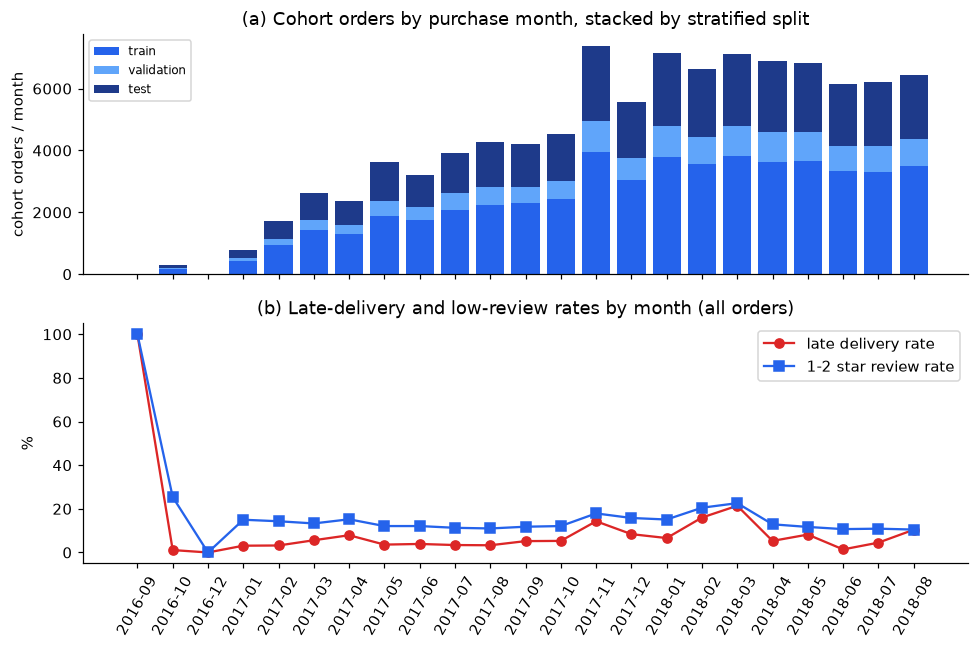

# Low-Review Classification · Current Review Entry Point

**Protocol change: 2026-10-09 (dry run, `QUICK = True`).** The package now uses the split design of
Zaghloul, Barakat & Rezk (2024, *J. Retailing and Consumer Services* 79:103865) — the published study on
the same Olist target — with a validation set added: stratified 67/33 train+validation / test on
`is_low_review`, then stratified 80/20 train / validation (overall 53.6 / 13.4 / 33.0, seed 5006).
The chronological, label-matured protocol of the regression package is kept as a switch
(`clf_config.SPLIT_SCHEME = "chronological"`) and its last results are summarised at the end as a
robustness reference. Latest entry points:
[baseline_variant_review.ipynb](../notebooks/baseline_variant_review.ipynb) (family ladder, Table 7) and
[ensemble_comparison.ipynb](../notebooks/ensemble_comparison.ipynb) (Family C, class-balance study).
Ensemble methods and findings: [ensemble_comparison.md](ensemble_comparison.md); imbalance strategies
(none / weights / RandomOverSampler / SMOTE / ADASYN) and SHAP: [sampling_comparison.md](sampling_comparison.md).

All numbers below come from the committed dry run (4 random-search draws per family, 100-tree forests,
≤ 200-iteration CatBoost). They validate the code path; the report numbers must come from a
`QUICK = False` run (see "Reproduce").

## Problem and experiment boundary

Predict, for each order, whether its review will be 1-2 stars (`is_low_review`), one row per order. The
prediction point is **T = min(delivered date, estimated delivery date)**: Olist sends the review survey at
delivery or at the promised date if the parcel has not arrived, so T is the last moment an intervention
can precede the rating. Inputs are restricted to what is known at T: order composition, prices and
freight, product dimensions, customer/seller geography (audited zip-prefix coordinates and maximum
item-route distance from `../src/data_preparation_audit.py`), the promise length, point-in-time seller
and route history, and the delivery status as of T. Review text, review timing, actual delivery after T
and anything dated after T are excluded (`config/feature_roles.csv`, role `post_outcome`). Full
specification in [`config/problem_spec.json`](../config/problem_spec.json).

**Features from the literature.** The five engineered features of Zaghloul et al. (§3.4) are included in
prediction-point-safe form: `total_order_value` (price + freight), `payment_total`, `freight_ratio`, and
the two working-day delivery features `wd_actual_delivery_time` and `wd_delivery_time_delta` (Mon–Fri,
Brazilian national holidays excluded, evaluated as of T so they are NaN for the 10% of orders not yet
delivered when the survey is triggered). Their sixth top feature, `review_comment_message`, is part of the
review itself and is not used. 52 features in total.

**Cohort and split.** 97,916 reviewed orders with at least one line item, purchased 2016-09 to 2018-08.

| Split | Orders | Share | Positives | Positive rate | Delivered by T |
|---|---:|---:|---:|---:|---:|
| train | 52,482 | 53.6% | 7,436 | 14.17% | 89.9% |
| validation | 13,121 | 13.4% | 1,859 | 14.17% | 89.7% |
| test | 32,313 | 33.0% | 4,579 | 14.17% | 90.4% |

The split is uniform in time (every purchase month is ≈ 33% test / 13% validation) and is written to
`data/split_manifest.csv`; `scripts/verify_classification.py` rebuilds it from the seed and checks it
matches. Roles, fixed before fitting: **train** — pipelines and `StratifiedKFold(5, shuffle=True)` for
hyper-parameters and out-of-fold probabilities; **validation** — baselines vs ladder, CatBoost early
stopping, F1 threshold, stacking / ensemble retention rule; **test** — scored once per final model.

**Leakage control under a random split.** Because validation and test orders are interleaved in time with
training orders, every *outcome* that feeds a history feature (seller / route delivery days, late rate,
low-review rate) is aggregated from **training rows only**; "orders placed" counts, which involve no
outcome, use every row. The audit recomputes the smoothed seller late rate from train-only outcomes for
3,000 sampled orders and matches the stored value exactly (audit row = 1.0). Structural assert on feature
roles, delivery-as-of-T consistency and single-feature AUC (max 0.69, `is_delivered`) also pass; 3.1% of
reviews are written before T and are reported, not dropped.

## Current results (dry run)

| Model / rule | 5-fold CV PR-AUC | Validation PR-AUC | Test PR-AUC | Test ROC-AUC | Test P / R @ thr | Test Brier |
|---|---:|---:|---:|---:|---|---:|
| Majority class (nobody complains) | — | 0.142 | 0.142 | 0.500 | — | 0.122 |
| Rule: flag if not delivered by T | — | 0.334 | 0.327 | 0.680 | 0.60 / 0.41 | 0.123 |
| A · logistic, default C | — | 0.485 | 0.486 | 0.787 | 0.54 / 0.51 | 0.165 |
| A · logistic, C searched (C = 10) | 0.485 ± 0.014 | 0.484 | 0.486 | 0.787 | 0.54 / 0.50 | 0.165 |
| B · decision tree (depth 12, leaf 179) | 0.475 ± 0.012 | 0.493 | 0.482 | 0.772 | 0.55 / 0.48 | 0.169 |
| **B · random forest** (depth 24, leaf 95, max_features 0.70) | 0.501 ± 0.014 | **0.515** | **0.508** | 0.791 | 0.55 / 0.49 | 0.147 |
| B · CatBoost (depth 6, early-stopped at 197 it.) | 0.491 ± 0.019 | 0.504 | 0.500 | 0.788 | 0.52 / 0.52 | 0.161 |
| C · sklearn stacking of A/B (not retained) | — | 0.512 | 0.509 | 0.792 | 0.56 / 0.49 | 0.093 |

Source: [`outputs/tables/model_comparison.csv`](../outputs/tables/model_comparison.csv). CV, validation
and test now agree within one CV standard deviation for every model, which is what a stratified random
split should give. The random forest is the final single model; at its frozen threshold 0.66 it flags
12.7% of test orders with precision 0.55 (3.9× the 14.2% base rate) and recall 0.49; the top-10% list
captures 43% of all complaints. Stacking (0.512) does not reach the 1% relative validation gain required
for retention.

Permutation importance on validation: `is_delivered` (0.059), `n_items` (0.036), then the two
literature features `wd_delivery_time_delta` (0.025) and `wd_actual_delivery_time` (0.024) ahead of their
calendar-day counterparts, then `delivery_vs_seller_prior` (0.021). Removing the whole
delivery-as-of-T block drops the forest's validation PR-AUC from 0.515 to 0.285. SHAP on the final
forest ([sampling_comparison.md](sampling_comparison.md)) ranks `n_items`, `wd_delivery_time_delta`,
`delivery_time_delta`, `delivery_vs_seller_prior` and `wd_actual_delivery_time` top five; CatBoost
SHAP agrees at Spearman 0.87.



## Areas that need attention

1. **What the random split measures.** Validation and test share the training rows' month mix, so the
   scores estimate performance on the 2016-18 order mix, not on a future month. The March 2018 postal
   disruption (21% late, 23% low reviews) is diluted into every partition. State this in the report and
   quote the chronological reference below as the drift cost.
2. **History features are stricter than production.** Only training-row outcomes feed them, so a seller's
   prior late rate is estimated from ~54% of their history. In deployment all past outcomes would be
   available; the features would be slightly stronger, not weaker.
3. **No imbalance strategy improves ranking.** The 4 × 5 grid in
   [sampling_comparison.md](sampling_comparison.md) (none / class weights / RandomOverSampler / SMOTE /
   ADASYN) shows `none` best on validation and test PR-AUC for every model; weighting and random
   oversampling coincide and double the Brier score (0.092 → 0.147 for the forest), SMOTE / ADASYN cost
   1–3 PR-AUC points. Report the unweighted forest as the final scorer with the validation-frozen
   threshold, and quote the grid as the class-imbalance discussion the brief asks for.
4. **Ensembles are within noise of the forest** (test 0.507–0.510 vs 0.508; validation 0.509–0.514 vs
   0.515) because the three base models' OOF probabilities correlate at 0.95–0.97. Not retained under
   the 1% rule; the logistic stack is nevertheless the best-calibrated scorer (Brier 0.092).
5. **Run the full search before quoting numbers.** `QUICK = True` uses 4 draws and 100-tree forests;
   CatBoost in particular is under-searched (200 iterations in the grid). Expect 1–2 h for
   `baseline_variant_review` with `QUICK = False`; `sampling_comparison` adds 20 fits and the SHAP sample.
6. **Hash verification.** Any edit to `src/clf_*.py` or the scripts changes a source digest; rerun
   `scripts/reproduce_classification.py` (or `--protocol-only` after `run_notebook.py`) to refresh
   `outputs/experiment_protocol.json`.

## Chronological reference (previous protocol, dry run of 2026-10-07)

With `SPLIT_SCHEME = "chronological"` (regression package windows: train = purchased and reviewed before
2018-03-01, validation = March 2018, April–June maturation gap, test = July–August 2018; 49 features, no
working-day features) the same ladder gave random forest validation PR-AUC 0.642 on March (positive rate
22.6%) and **test PR-AUC 0.360** on July–August (positive rate 10.7%, majority baseline 0.107); logistic
0.349, CatBoost 0.357, ensembles 0.364–0.368. The gap to the stratified 0.508 is prevalence shift plus
drift, not model quality: PR-AUC scales with the positive rate (baseline 0.107 vs 0.142) and the test
months were the calmest in the data. Re-run with the switch to refresh this reference once the final
configuration is fixed; it belongs in the report's Limitations.

## Reproduce

From the group repository root, `cd "Phase 2/classification"`. Course CSVs are found via
`OLIST_CSV_DIR`, the repository's `notebooks/data/`, or the course ZIP via `OLIST_ARCHIVE`
(same archive as the regression package, SHA256
`90ee50730a9e799aa2d3c7b1758fef680cbbc366f61a287870144796a37156d4`).

```bash
python -m pip install -r ../requirements.txt -r requirements.txt
python scripts/run_notebook.py notebooks/data_preparation_audit.ipynb      # 1 min; writes data/split_manifest.csv
python scripts/run_notebook.py notebooks/baseline_variant_review.ipynb     # set QUICK = False in cell 1
python scripts/run_notebook.py notebooks/ensemble_comparison.ipynb
python scripts/run_notebook.py notebooks/sampling_comparison.ipynb     # 20 fits + SHAP
python scripts/reproduce_classification.py --protocol-only                 # digests -> outputs/experiment_protocol.json
python scripts/verify_classification.py                                    # 36 checks incl. split manifest and train-only history
python -m unittest discover -s tests -v                                    # 11 tests, synthetic data, seconds
```

Git-ignored and regenerated locally: `data/` (feature table, split manifest), `models/`,
`outputs/predictions/`, `outputs/oof/`.
