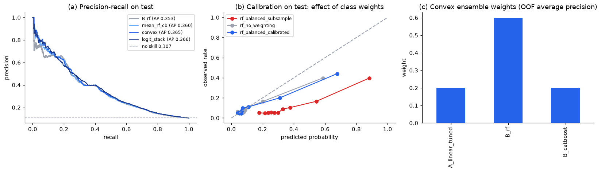

# Logistic + Random Forest + CatBoost: Averaging, Convex Weights and Logistic Stacking

Updated: 2026-10-07 (dry run, `QUICK = True`)

The [executed Notebook](../notebooks/ensemble_comparison.ipynb) is the single entry point
for the Family C comparison. It mirrors the regression package's
[ensemble_comparison.ipynb](../../notebooks/ensemble_comparison.ipynb): base models are
refitted per matured fold to produce out-of-fold (OOF) probabilities, the combiners are fitted
on those OOF rows only, selection happens on March validation, and the test window is scored
once per method with an independent PR-AUC implementation as a cross-check.

## Base models and OOF construction

Base models are the three tuned configurations retained in
[baseline_variant_review.ipynb](../notebooks/baseline_variant_review.ipynb):
`A_linear_tuned` (logistic regression, C = 0.001, class-weighted),
`B_rf` (random forest, depth 17, min leaf 89, max features 0.49, `balanced_subsample`) and
`B_catboost` (depth 4, learning rate 0.033, early-stopped on validation). Each is refitted
on the three expanding matured folds (cutoffs 2017-07-01, 2017-10-01, 2018-01-01); a fold
fits only on orders whose review was already written at its cutoff and scores the next
window. Concatenating the three scored windows gives **39,751 OOF rows** covering
July 2017 to February 2018. The first window (July–September 2017, 13,395 fit rows) is a
warm-up period with the least history and enters the combiner fits with equal weight.

## The combiners

| Method | Definition | Learnt on OOF |
|---|---|---|
| `mean_three` | arithmetic mean of the three probabilities | nothing |
| `mean_rf_cb` | mean of the two tree models | nothing |
| `convex` | `w · p` with `w ≥ 0, Σw = 1`, chosen on a 0.05 simplex grid to maximise OOF average precision | 3 weights |
| `logit_stack` | logistic regression on the three logits, class-weighted | 3 coefficients + intercept |

Weights are found by grid search on average precision rather than by minimising log-loss:
log-loss collapses the weights onto the best-calibrated model (the forest) because the
three base models are calibrated differently, whereas the ranking metric is what the
stakeholder uses. The dry-run convex weights are 0.25 logistic / 0.55 forest / 0.20 CatBoost;
the logistic stack gives coefficients 0.63 / 0.48 / −0.02, i.e. it ignores CatBoost. Both are
re-learnt whenever the base models change. A convex combination cannot rank an order above
the highest or below the lowest base probability; the logistic stack can rescale but not
reorder beyond what the three logits span.

## Comparison on the same windows

| Method | March PR-AUC (selection) | Test PR-AUC | Test ROC-AUC | Test Brier |
|---|---:|---:|---:|---:|
| `A_linear_tuned` | 0.598 | 0.349 | 0.734 | 0.166 |
| `B_rf` (final single model) | **0.642** | 0.360 | 0.731 | 0.152 |
| `B_catboost` | 0.600 | 0.356 | 0.729 | 0.183 |
| `mean_three` | 0.624 | 0.365 | 0.735 | 0.165 |
| `mean_rf_cb` | 0.634 | 0.365 | 0.732 | 0.166 |
| `convex` (AP-optimal weights) | 0.633 | **0.368** | 0.734 | 0.160 |
| `logit_stack` | 0.620 | 0.364 | **0.736** | **0.087** |

Source: [`outputs/tables/ensemble_test_results.csv`](../outputs/tables/ensemble_test_results.csv)
and [`ensemble_weights.csv`](../outputs/tables/ensemble_weights.csv); thresholds in
[`outputs/ensemble_summary.json`](../outputs/ensemble_summary.json).

**Decision: no ensemble retained; the final model stays `B_rf`.** The retention rule,
fixed before scoring (`config/problem_spec.json`), requires a ≥ 1% relative gain in
validation PR-AUC over the best single model. The best combiner on March (`mean_rf_cb`,
0.634) is 1.3% *below* the forest. On the test window every combiner is 1–2% above the
forest (0.364–0.368 vs 0.360), and the logistic stack has by far the best Brier score
(0.087 vs 0.152) because its intercept re-centres the probabilities; these are reported as
evidence, not used for selection, because reversing the decision after seeing the test
scores would make the test window part of model selection.

Why the two windows disagree: March 2018 has a 22.6% complaint rate (postal strike) and
77% of orders delivered by T, so a model that leans hardest on the delivery-at-T block
(the forest) ranks March best; the test window is back to a 10.7% rate and 91% delivered by
T, where averaging in the logistic model's smoother geography and composition effects helps
slightly. The 1% rule plus March-only selection is conservative here, which is the intended
behaviour of a pre-registered rule.



## Class-balance study

Same notebook, Section 5; the question is whether class weighting is doing anything that a
threshold could not. Three forest variants with the retained hyper-parameters:

| Variant | March PR-AUC | Test PR-AUC | Test Brier | Flag rate @ 0.5 | Recall @ 0.5 | Recall @ tuned thr. |
|---|---:|---:|---:|---:|---:|---:|
| no weighting | 0.643 | 0.356 | **0.086** | 7.8% | 0.32 | 0.41 |
| `balanced_subsample` (retained) | 0.642 | 0.360 | 0.152 | 16.3% | 0.48 | 0.41 |
| `balanced_subsample` + isotonic calibration on March | 0.633 | 0.339 | 0.086 | 6.7% | 0.29 | 0.41 |

Source: [`outputs/tables/class_balance_study.csv`](../outputs/tables/class_balance_study.csv).

Ranking quality is unchanged by weighting (test PR-AUC 0.356 vs 0.360, within noise) and
recall at the validation-tuned threshold is identical (0.41); what changes is the
probability scale, so the Brier score worsens and the default-cut flag rate doubles.
Weighting therefore acts as a built-in threshold shift. Calibrating on March fixes the
scale but harms ranking on test because March's prevalence is twice the test window's.
Resampling (SMOTE, Appendix A3 in `baseline_variant_review.ipynb`) is optional and was
skipped in the dry run (`imbalanced-learn` not installed); given the above it is not expected
to help ranking. Recommendation for the report: keep weighting only as a documented choice
paired with a frozen threshold, or use the unweighted forest with the same threshold search;
either way report Brier alongside PR-AUC and do not read probabilities as calibrated risks.

## Temporal boundaries and evidence limitations

- Train labels must be written before 2018-03-01; validation labels before 2018-07-01;
  April–June 2018 is a maturation gap and is never modelled or scored.
- All preprocessing (imputation, one-hot / target encoding, scaling) is fitted inside each
  fold's training rows; the OOF refits use the searched hyper-parameters from
  `outputs/selected_models.json` (in the dry run CatBoost is capped at 150 iterations and
  the forest at 100 trees for the refits).
- The three-fold OOF set is small for a meta-learner (39,751 rows, three columns) and its
  first window is a warm-up; the weights sit on a 0.05 grid and should be read as
  indicative, not as stable estimates. The full run should report them with that caveat.
- The test window was scored once per method here, so **these test numbers are the only
  test scores for this package**; a `QUICK = False` rerun replaces them in full and must not
  be followed by any further selection.
- The regression package's test window had been inspected during its stacking development;
  this classification package has not reused those results, but it shares the same windows
  and the report's Limitations section should state both facts.

## Reproduce

```bash
cd "Phase 2/classification"
python scripts/run_notebook.py notebooks/baseline_variant_review.ipynb   # produces selected_models.json
python scripts/run_notebook.py notebooks/ensemble_comparison.ipynb       # ~20 min QUICK, ~1 h full
python scripts/verify_classification.py
```

`ensemble_comparison.ipynb` reads `outputs/selected_models.json` and the feature table in
`data/`; run `baseline_variant_review.ipynb` first. OOF probabilities are saved to
`outputs/oof/base_oof_probabilities.csv` (git-ignored) for inspection.
