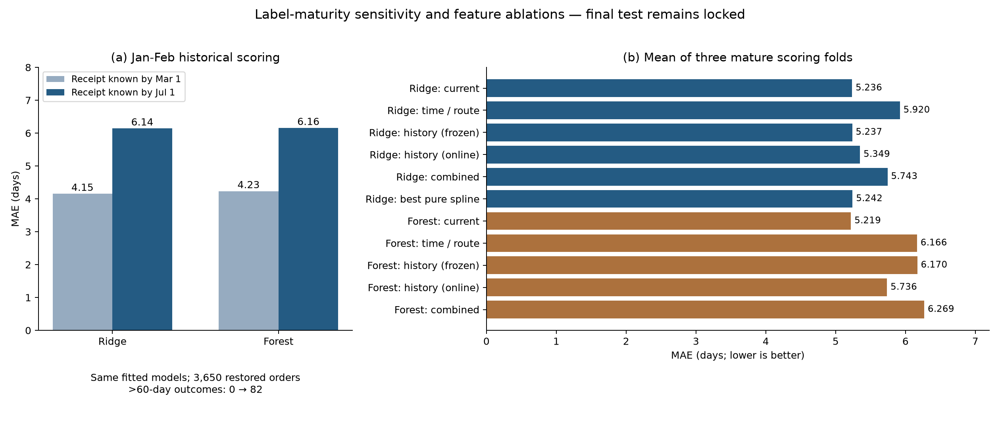

# Delivery Regression · 当前审阅入口

实验更新：2026-10-05；小组共享：2026-10-07。本目录是Phase 2配送回归开发审阅快照，供讨论模型改进；不是最终提交或已部署系统。Stacking尚未拟合，七月及之后的最终测试没有评分。

## 先看这些文件

1. [最新实验Notebook](../notebooks/feature_optimization.ipynb)：成熟标签回测、时间/路线/历史/样条比较、选择结果和已运行检查。
2. [最新中文结论](feature_optimization.md)：解释为何未采用新增特征，以及历史CV为什么需要修正。
3. [上一轮baseline/变体Notebook](../notebooks/baseline_variant_review.ipynb)及[中文说明](baseline_variant_review.md)：Ridge正则化/输入log、森林复杂度、近期权重与损失检查。
4. [数据审计Notebook](../notebooks/data_preparation_audit.ipynb)：有效订单、目标、输入可见性、地理修正证据。

`notebooks/delivery_regression_phase2.ipynb`、顶层`outputs/`和原`docs/report_section.md`保留首轮v1历史语境；最新结果以本入口及`versions/feature_optimization_v3/outputs/`为准。旧正式交接不能与新输入/模型混用。

## 问题和实验边界

预测下单到客户收货的连续天数，一单一行；输入限于下单时信息及明确时点可见的历史事件。课程固定ZIP提供96,470笔可计算完成配送目标，306筆>60天有效订单保留。训练为购买且收货早于2018-03-01的53,644笔；三月验证7,003笔；七月起最终测试锁定。原始报价与商品/地理快照可用性仍为归档假设。

历史CV模型只用每折起点前已收货的训练标签；评分窗口的结果另允许成熟至七月前，恢复3,669笔慢订单。模型选择通过成熟历史回测进行；三月已经用于开发，不能作为独立最终测试宣传。

## 当前结果

| 模型/规则 | 三月MAE（天） | 成熟历史CV MAE（天） |
|---|---:|---:|
| 直接预测原承诺时长 | 9.825 | 未作为本轮CV候选 |
| 训练均值 | 8.407 | 未作为本轮CV候选 |
| 普通线性baseline | 6.918 | 10.282 |
| 单树baseline | 7.236 | 5.365 |
| 保留Ridge：7项输入log1p、alpha1000 | **6.847** | 5.236 |
| 保留森林：180天近期权重、depth24、leaf10 | **6.913** | 5.219 |

引用规则来自[同样本参照表](../versions/baseline_review_v2/outputs/tables/model_comparison.csv)；保留模型和baseline来自[最新模型表](../versions/feature_optimization_v3/outputs/tables/model_comparison.csv)与[历史CV表](../versions/feature_optimization_v3/outputs/tables/cv_summary.csv)。OLS历史CV受早期稀少月份系数不稳定影响，不能只用三月分数忽略这一风险。

两轮有限比较均有完整配置、源指纹和选择记录。本轮18组分阶段开发搜索的时间/路线/历史/样条候选没有稳定胜过保留方案。当前模型仍平均低估约4.2天，三月约40%订单误差不超过3天，慢配送误差突出。结论是有预测信号且优于简单参照，但精度有限，不能宣称可靠到货日承诺。



## 可以重点讨论的改进

- 当前输入能否表达更多下单时可见的地区/物流变化；提出字段时同时说明其来源和预测时可见性。
- 历史统计的窗口、分组、回退与时间漂移；已有冻结/逐笔更新实现未带来稳定收益，不能当作已证明有效。
- 慢订单误差与业务容差；总体MAE改善不等于尾部准确。
- 评价口径与标签成熟选择；旧约4.54天CV不能与成熟CV约5.2天混称同一个成绩。

这是审阅方向，不是已完成的新模型。后续正式工程仍需一致整合数据v2、保留参数和成熟CV，并在方案冻结后进行独立stacking/最终测试。

## 独立复现

从小组仓库根目录先执行`cd "Phase 2"`，以下命令均在本目录执行。原始数据仍使用同一份课程ZIP，不需要更新数据集。

安装`requirements.txt`，准备课程原版`IT5006_Project-Data.zip`（SHA256：`90ee50730a9e799aa2d3c7b1758fef680cbbc366f61a287870144796a37156d4`），运行：

```bash
python scripts/reproduce_review.py --archive /absolute/path/IT5006_Project-Data.zip
```

命令只读取课程ZIP，在本地生成审计v2数据、重跑最新18组比较、重建图表并核对指标/历史时点；不会评分最终测试或拟合stacking。单独克隆本仓库时，原首轮私有交接文件不存在，相关历史哈希检查明确跳过；新实验的指标/时间/OOF/模型检查仍执行。该命令不改已运行Notebook的显示输出；Notebook保存此次本地执行结果，代码与源协议均可追溯。

2026-10-05已在独立源代码目录中从课程ZIP运行上述命令：18配置、3时间折和7,003笔三月比较重现，指标/时点/OOF/模型检查通过，最终测试未评分；原首轮私有交接哈希检查按说明跳过。

GitHub包含源码、已运行Notebook、摘要表、图和结论。课程原始数据、逐订单输入/预测、OOF及拟合模型不在GitHub；它们可按上述命令从课程原数据生成。部分历史来源链接指向课程本地相邻资料目录，在单独克隆时不会存在，官方项目说明链接保持可用。

AI协助实现与核查，结果和局限由项目统一审阅。
